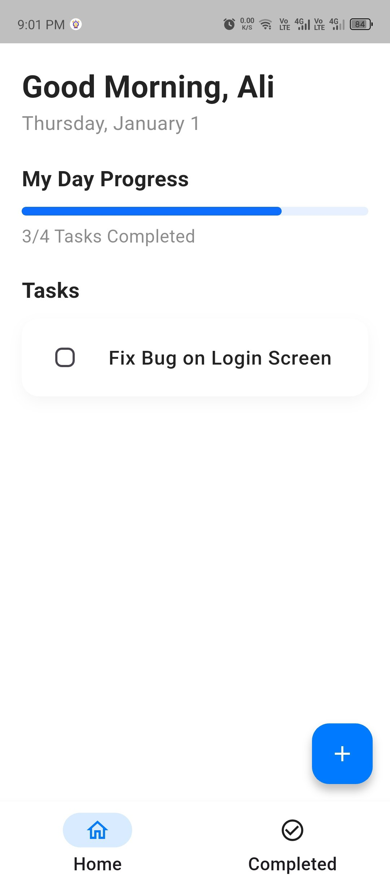
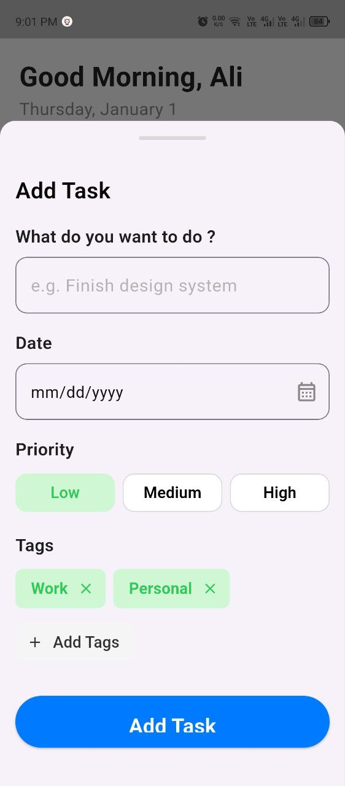
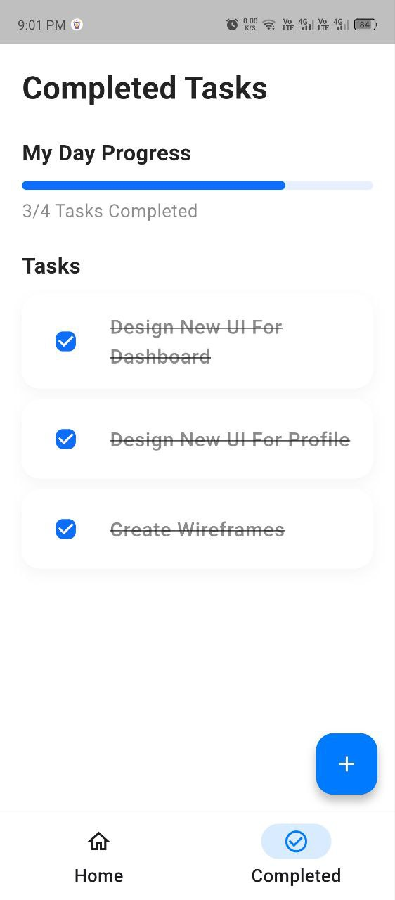

# 📝 To-Do App

A clean and intuitive To-Do List application built with **Flutter**. This app helps users manage their daily tasks efficiently with priority levels, categories, and progress tracking.

## 📱 App Screenshots

| Home Screen | Add New Task | Completed Tasks |
|:---:|:---:|:---:|
|  |  |  |

## ✨ Features

* **Task Management:** Add, edit, and delete tasks easily.
* **Progress Tracking:** Visual progress bar showing daily completion rate.
* **Task Categorization:** Organize tasks with tags (e.g., Work, Personal).
* **Priority Levels:** Set priorities (High, Medium, Low) to focus on what matters.
* **Date Scheduling:** Pick specific dates for your deadlines.
* **Completed History:** Separate view for finished tasks to track accomplishments.

## 🛠️ Tech Stack

* **Framework:** Flutter
* **Language:** Dart
* **Architecture:** MVC / MVVM (Choose what you used)
* **State Management:** Provider / Bloc / GetX (Edit this based on what you used)
* **Database:** Hive / Sqflite / Shared Preferences (Edit this)

## 🚀 How to Run

1.  **Clone the repository:**
    ```bash
    git clone [https://github.com/YourUsername/todo-app.git](https://github.com/YourUsername/todo-app.git)
    ```
2.  **Navigate to the project directory:**
    ```bash
    cd todo-app
    ```
3.  **Install dependencies:**
    ```bash
    flutter pub get
    ```
4.  **Run the app:**
    ```bash
    flutter run
    ```

## 📬 Contact

* **LinkedIn:** [Mohamed Hassan](https://www.linkedin.com/in/mohamed-hassan-pro/)
* **Email:** [mohamedhassankamel9l@example.com]

---
*Made with ❤️ by Mohamed Hassan*
